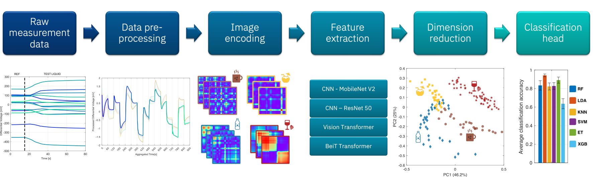

# AI-assisted-chemical-sensing


This repository provides **chemsense**, a package developed for chemical sensor array data processing. **chemsense** leverages visual encoding of sensor data and pre-trained vision models to extract vector-based measurement representations, i.e. the "digital fingerprints" of the chemical specimens under test. The package enables also training of machine learning models to calibrate and configure sensor arrays for any classification task.



The code provided in this repository was used to generate the results for a paper that has been submitted for peer review.

## Installation

Clone repository and navigate to local directory:

```console
git clone https://github.com/IBM/AI-assisted-chemical-sensing.git
cd AI-assisted-chemical-sensing
```

Create and activate virtual environment. Then run:

```console
pip install .
```
### Development setup

If you would like to contribute to the package, we recommend installing the package in editable mode after environment creation:

```console
pip install -e ".[dev,analysis]"
```

## Getting started
The source code can be used for processing of sensor array measurement data and for training/testing of machine learning models. The following functionalities are provided:
- encoding of sensor array measurement data into image representation ([GAF encoding](https://arxiv.org/abs/1509.07481))
- processing of image data by means of pre-trained vision models (ViT, BeiT, MobileNet, ResNet) to extract vector-based measurement representations 
- training a library of classification models with various validation strategies

The code functionalities can be adapted to enable processing of any sensor data modality. The example provided in this repository refers to measurements performed with a [potentiometric electronic tongue](https://pubs.acs.org/doi/10.1021/acs.analchem.1c03709). 
An example dataset is provided [here](./src/chemsense/vision/resources/datasets/red_wines). Each file contains the recording of 15 time-dependent differential voltages for a test performed with a red wine sample. 

## Running pipeline via the CLI commands

It is possible to run parts of the data processing pipelines directly from the command line using the commands described below.

### Image encoding

`chemsense-encode-images` can be used to transform raw sensor array data into image representations and save them for further processing.

```console
Usage: chemsense-encode-images [OPTIONS]

Options:
  --task TEXT                 Task name to be used as identifier.
  --data_path PATH            Path to directory containing sensor raw data.
                              [required]
  --export_spectra_path PATH  Path to save processed sensor data.  [required]
  --export_images_path PATH   Path to save generated images.  [required]
  --help                      Show this message and exit.
```

You can generate images for the example dataset simply by typing:

```console
chemsense-encode-images --data_path src/chemsense/vision/resources/datasets/red_wines --export_spectra_path data/spectra --export_images_path data/images
```

### Image processing

`chemsense-process-images` can be used to extract feature vectors from image dataset leveraging pre-trained vision models.

```console
Usage: chemsense-process-images [OPTIONS]

Options:
  --task TEXT           Dataset name identifier.
  --batch_size INTEGER  Batch size for image loading and processing.
  --data_path PATH      Path to image directory.  [required]
  --features_path PATH  Path to save extracted features.  [required]
  --help                Show this message and exit.
```
You can process images generated for the example dataset simply by typing:

```console
chemsense-process-images --data_path data/images --features_path data/features
```

### Classification model head training

`chemsense-classification-analysis` can be used to train a lbrary of machine learning models (LDA, Random Forest, KNN, SVM, Extra Trees and XG Boost) with principal components extracted from vector-based measurement representations.

```console
Usage: chemsense-classification-analysis [OPTIONS]

Options:
  --task TEXT                     Dataset name identifier.
  --validation TEXT               Validation strategy. Supported types are
                                  kfold, LOCO, few_shots and Sugar_LOCO.
  --number_of_folds INTEGER       number of folds to be used in case of kfold
                                  validation.
  --number_of_components INTEGER  Max number of principal components to be
                                  used.
  --features_path PATH            Path to directory containing extracted
                                  features.  [required]
  --output_path PATH              Path to save classification model validation
                                  results.  [required]
  --help                          Show this message and exit.
```
You can train and validate models using feature vectors extracted for the example dataset simply by typing:

```console
chemsense-classification-analysis --features_path data/features --output_path results
```

### Image data augmentation and model training with few instances

It is possible to validate classification performances using only few training instances and leveraging image data augmentation. `chemsense-few-shot-analysis` enables classification model training using only 3, 5 or 7 training measurements per-class.

```console
Usage: chemsense-few-shot-analysis [OPTIONS]

Options:
  --task TEXT           Dataset name identifier.
  --n_comp INTEGER      Number of principal components to be used as
                        predictors.
  --mix_ratio FLOAT     Fraction of pixel intensity for image mixing and data
                        augmentation. Needs to be between 0 and 1.
  --batch_size INTEGER  Batch size for image loading and processing.
  --data_path PATH      Path to image directory.  [required]
  --output_path PATH    Path to save classification model validation results.
                        [required]
  --help                Show this message and exit.
```

You can train and validate models using few training instances and image data augmentation simply by typing:

```console
chemsense-few-shot-analysis --data_path data/images --output_path results
```

### Change default settings

You can change the values of the environment variables to modify the default settings for:

- the minimum number of principal components to be used as model predictors ("MINIMUM_COMPONENTS_NUMBER")
- the step size for varying the number of principal components to be used ("COMPONENTS_STEP") 
- number of times the kfold split is repeated for model validation ("NUMBER_OF_REPEATS")
- number of synthetic image samples to be generated per-class ("NUMBER_OF_IMAGES")

Current default values are:

```
"MINIMUM_COMPONENTS_NUMBER"=5
"COMPONENTS_STEP"=5
"NUMBER_OF_REPEATS"=50
"NUMBER_OF_IMAGES"=50
```

## License

All source code is made available under an Apache 2.0 license. 
Detailed description of the the license terms is provided [here](./LICENSE.md).

The manuscript text is not open source. The authors reserve the rights to the
article content, which is currently submitted for peer review.
